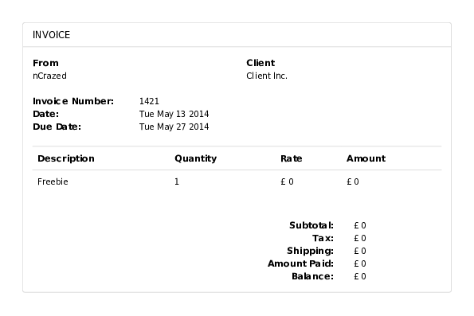

invoice-ninja
=============

Simple invoice generator

Getting Started
---------------
```bash
npm install invoice-ninja
```

Example Usage
-------------
```js
var fs = require('fs');
var Invoice = require('./index.js');

today = new Date();
due = new Date()
due.setDate(today.getDate() + 14);

input = {
  currencyFormat: "£%d",
  invoice_number: 1421,
  date_now: today.toDateString(),
  date_due: due.toDateString(),
  from_name: 'nCrazed',
  client_name: 'Client Inc.',
  items: [
    {
      description: 'Freebie',
      quantity: 1,
      rate: 0,
      amount: 0
    }
  ]
};

var invoice = new Invoice();
invoice.generatePDFStream(input).pipe(fs.createWriteStream('invoice.pdf'));
```

The above code would create a pdf file that looks like this:


Options
-------

Optional absolute paths to your custom template and/or css files.

### options.baseTemplate
Type: `String`

Default: `template.md`

### options.rowTemplate
Type: `String`

Default: `row.md`

### options.cssPath
Type: `String`

Default: `bootstrap.css`

Input
-----

All but `currencyFormat` are optional.

#### input.currencyFormat
Type: `String`

Format string for currency values.
It's passed to `util.format` as the first argument and should include 
the currency symbol and the `%d` placeholder.

#### input.invoice_number
Type: `String`

#### input.date_now
Type: `String`

#### input.date_due
Type: `String`

#### input.subtotal
Type: `Number`

#### input.tax
Type: `Number`

#### input.shipping
Type: `Number`

#### input.paid
Type: `Number`

#### input.balance
Type: `Number`

#### input.from_name
Type: `String`

#### input.from_street
Type: `String`

#### input.from_city
Type: `String`

#### input.from_county
Type: `String`

#### input.from_post_code
Type: `String`

#### input.from_country
Type: `String`

#### input.client_name
Type: `String`

#### input.client_street
Type: `String`

#### input.client_city
Type: `String`

#### input.client_county
Type: `String`

#### input.client_post_code
Type: `String`

#### input.client_country
Type: `String`

#### input.items
Type: `Array`

Each element of the array represent a single item.

#### input.items.description
Type: `String`

#### input.items.quantity
Type: `String`

#### input.items.rate
Type: `Number`

#### input.items.amount
Type: `Number`

